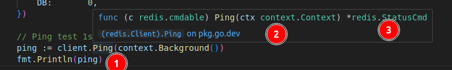
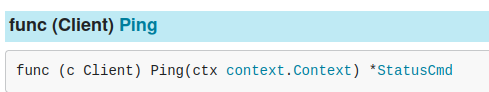
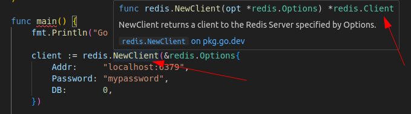
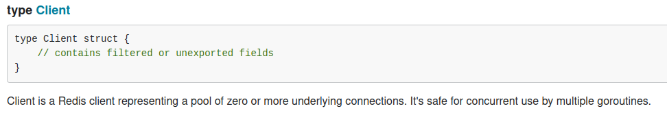
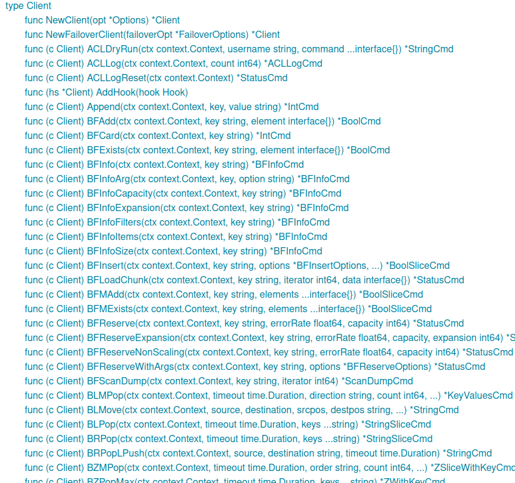
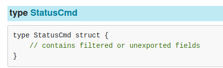
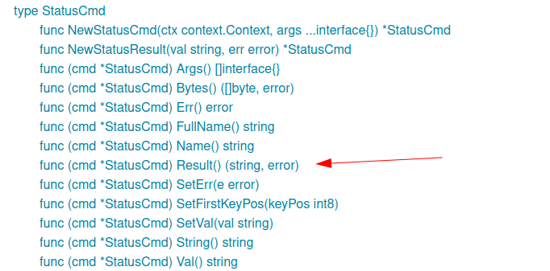
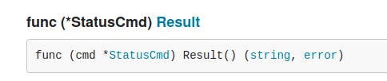

## About `redis.Client` struct's `Ping()` function

---
## About `redis.NewClient()` function

---

## About `redis.Client` struct and `few` of its methods
- https://pkg.go.dev/github.com/redis/go-redis/v9#Client 

## About `redis.Client` struct's `Ping()` function's return variable is `*redis.StatusCmd` struct and also about the about the `Result()` function of `StatusCmd` struct.
- https://pkg.go.dev/github.com/redis/go-redis/v9#StatusCmd 

